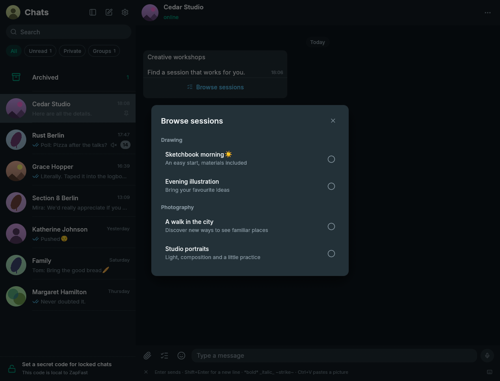
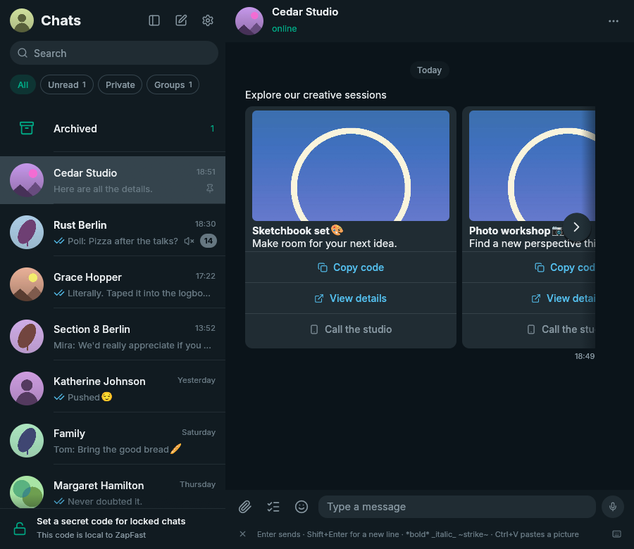
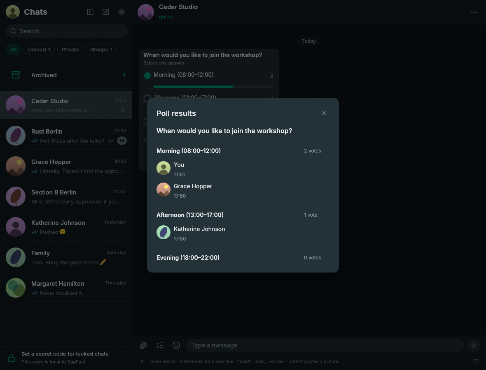

# Interactive message actions

This note records the compatibility boundary for PR #113 and issue #28.

## Protocol support

ZapFast uses the pinned whatsapp-rust sender. Its
[outgoing message classifier](https://github.com/oxidezap/whatsapp-rust/blob/ae3cefd86065872a577bbd0ad5ee21b60c86c616/wacore/src/send/classify.rs)
explicitly handles template replies, button responses, list responses, and
native-flow responses. The application constructs those library message types
and uses its existing quote, encryption, send, receipt, and expiration paths.
It does not emulate browser clicks or send the displayed label as plain text.

Synthetic tests check the supported response types against the pinned
whatsapp-rust classifier. The worker resolves each selection against the
original archived message before constructing its quoted response.

## Supported actions

| Received action | ZapFast behavior |
| --- | --- |
| Legacy response button | `ButtonsResponseMessage`, preserving selected id and display text |
| Hydrated quick-reply template | `TemplateButtonReplyMessage`, preserving selected id and original index |
| Native-flow `quick_reply` | `InteractiveResponseMessage` with the selected id and label |
| Legacy single-select list | Choice dialog followed by `ListResponseMessage` with the row id |
| Native-flow `single_select` | Choice dialog followed by a native-flow response with the row id |
| HTTP(S) URL | Open the validated URL in the system browser |
| Native-flow `cta_copy` | Copy the supplied code locally, without a message send |
| Calls, forms, payments, shopping flows, carousel reply choices, unknown or incomplete actions | Unavailable, with an explanation pointing to WhatsApp Web or the phone |

Choice indices in the UI refer only to the displayed, validated options.
The worker re-reads the original archived protobuf to resolve protocol ids.
Response parameters contain only the chosen id, without unrelated JSON fields. Outgoing cards, edited or
revoked sources, invalid indices, and read-only conversations cannot produce
an interactive response. In-flight sends prevent repeated clicks until the
ordinary send result arrives; a failure permits another attempt.

The version-4 derived-content backfill upgrades existing cards and legacy
placeholders without relinking, preserving local image paths (including each carousel card), edits, reactions,
read state, and original protobuf. No schema migration is required.

## Verification

Carousel navigation uses overlaid previous/next arrows instead of a bottom
scrollbar. It advances by one card, hides controls at the ends, and retains
Shift + mouse-wheel and horizontal touchpad input. Synthetic UI tests cover both ends and the
middle, keyboard navigation, and preventing clicks from reaching card actions.

Tests use synthetic messages and cover serialization, the pinned library's
outgoing classification, quotes and expiration, invalid actions, index mapping,
archive recovery, pointer and keyboard input, clipboard output, and send-state
release. Regression tests also cover mixed and filtered option indices, repeated
clicks, unrelated send results, per-card image paths, latest voter details, and
zero-vote options remaining visible in the results dialog, live empty polls staying
out of history recovery, offline/PDO/replayed polls retaining recovery, and list
dialog cancellation or connection changes never sending a reply. Demo screenshots use `interactive`, `interactive-media`, and
`interactive-actions`, and `interactive-list-dialog`, with `,light` for the light theme.

These checks do not establish live compatibility with every business bot.
End-to-end validation requires the user to click a real received option and
confirm both the outgoing quoted response and the business's follow-up. No
personal archive contents or screenshots belong in fixtures or documentation.

## Native interface

| Type | ZapFast behavior |
| --- | --- |
| List | Centered dialog with a close control, section headings, descriptions, option selectors, full-row hover, keyboard activation, and a bounded scrolling area |
| Poll | Ballot with persistent result tracks, a checkmark for the selected answer, and Show votes; the results dialog lists known participants and vote times, with an incomplete-history notice when needed |
| Carousel | Horizontal card strip with independent images and actions, a separate image cache per card, navigation arrows, and horizontal scrolling; web links and copy-code actions work, unsupported replies/calls/flows remain disabled |

Poll result details are derived from each participant's latest decrypted vote.
Withdrawals and undeciphered updates do not appear as voters. Names and vote
times reach the interface, while keys and encrypted payloads stay in the worker.
Details are not serialized into the message content JSON. This extends the
existing vote archive without creating a second source of truth.

Carousel images use the existing whatsapp-rust media downloader and retry path,
with the original message id and an explicit card index. Opening an image uses
the usual local file handler. Calls and carousel reply envelopes have not been
implemented merely because fields exist in the protobuf.

## Synthetic interface examples

